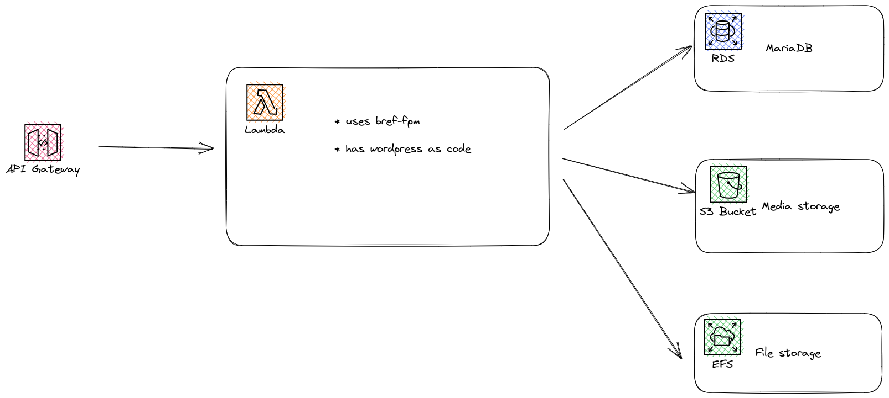

# Wordpress on Bref sample

## (Planned) Architecture



This sample is currently _not_ working.

## Installing wordpress

### Requirements
* Composer

### Installation
* Run
```bash
$ composer create-project roots/bedrock function-code
```

Inside the `function-code` directory, please also install `bref`:
```bash
$ composer require bref/bref
```

## Useful commands

* `npm run build`   compile typescript to js
* `npm run watch`   watch for changes and compile
* `npm run test`    perform the jest unit tests
* `cdk deploy`      deploy this stack to your default AWS account/region
* `cdk diff`        compare deployed stack with current state
* `cdk synth`       emits the synthesized CloudFormation template
